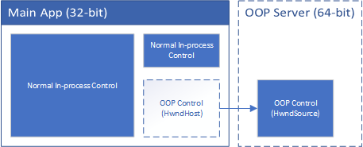

# ITP WPF Out-of-process

Library which allows for hosting a WPF control in a different process 
than the main application.  This can be useful if the control is prone to
crashing, or if the control is running in a different bitness or runtime.
For example, a legacy .Net Framework app can embed .Net Core controls and
benefit from API's which are exclusive to .Net Core.

The user cannot tell what controls are out-of-process.  Focus and keyboard
shortcuts are forwarded across process boundaries.

## IPC via COM (IDispatch registration-free)

The example application demonstrates using `IDispatch` to avoid having to
register COM Interfaces.  Note: IDispatch is not possible between netcore 
and netfx.  Use `IUnknown` with registration instead.

## IPC via COM (Traditional Registration)

You may host an out-of-process server via COM.  See [COM.md](docs/COM.md) 
for details.